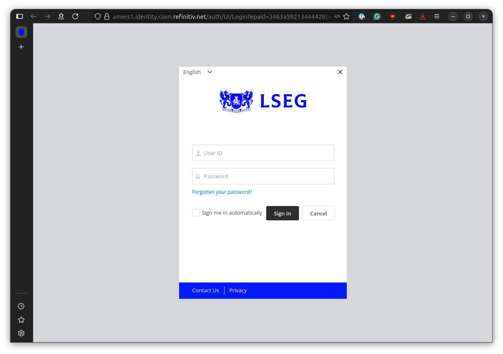
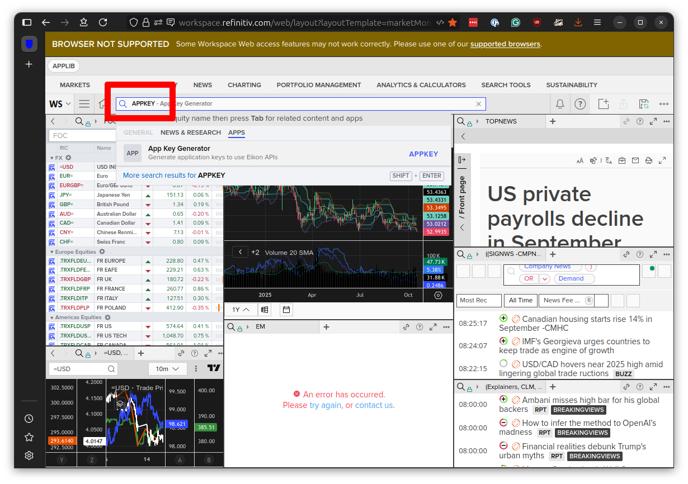

```{include} _templates/nav.html
```

# Creating an application key

Before you can connect with the [Refinitiv Data Library for Python](https://pypi.org/project/refinitiv-data/), you need to create an application key,  a unique identifier that allows you to connect to the platform and retrieve data.

Here's how to do it.

Select the [“web access portal”](https://eikon.refinitiv.com/Apps/EikonProductDownloadPage) from [eikon.refinitiv.com](https://eikon.refinitiv.com/).

[](https://eikon.refinitiv.com/Apps/EikonProductDownloadPage)

Sign in with your credentials.



Enter “appkey” in the search box in the far upper-left corner of the screen.



Select “App Key Generator” from the search results and hit enter. You should arrive at the administration panel for creating new keys.


Enter a name for your key in the “App Display Name“ field. Select the first three checkboxes — all but “Side by Side Web API” — in the “API” section. Click the “Register New App” button.


A popup will appear asking you to agree to the terms of use. Click “OK.”


A new row will appear in the table at the bottom of the screen. The “API Key“ column contains the token you will use to connect to the Refinitiv Data Library for Python. Save it to a secure location. The actual value of the key in the image below has been redacted.


You can now use this key to open a session in Python.